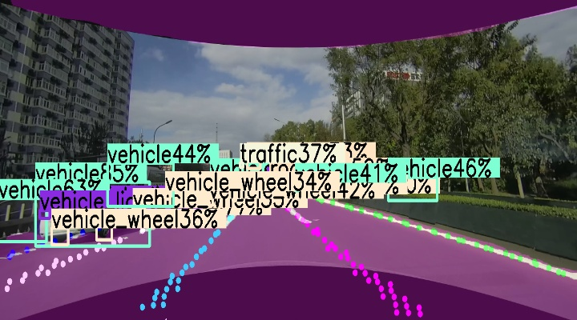

# Multitask Mono Camera Perception - Ultranet
## Introduction
This is my previous work on multitask perception in Forward Camera Settings\
This work further extend the hydranet to compromise three headers to improve its performance

It mainly contains three tasks:  
(1) object detection (instead of anchor based in hydranet, now this is anchor-free based on centerpoint detection)  
(2) semantic segmentation (almost the same as hydranet)  
(3) lane detection (instead of anchor line based, now this is pure point based lane detection like PINet)

 


## How to Run
### model training
```shell
# prepare data in model\data
# then edit config file in model\cfgs then start trainig
python train.py 
```
### model inference in python
```shell
python demo.py # set deploy = False
```

### model deploy and run in c++ using onnxruntime
```shell
# 导出onnx
python demo.py # set deploy = True
python -m onnxsim .\ultraNET.onnx .\ultraNET_simplify.onnx

# 编译运行
cd deploy && mkdir build && cd build && cmake ..
```


